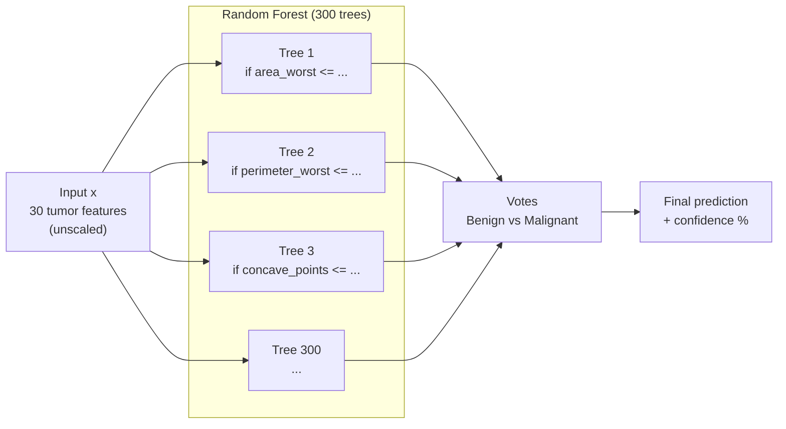
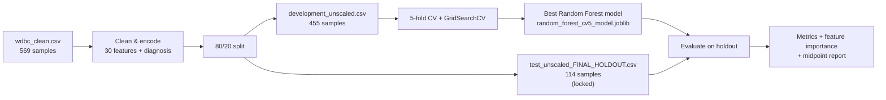

# Breast Cancer Random Forest — Diagrams

## 1. What the model is doing

Each new tumor enters the forest as a **30-feature vector** (unscaled).  
300 decision trees each make an independent prediction. The final class is chosen by **majority vote**.

### Inside one tree
- Trained on a **bootstrap sample** of the development data
- At each split, only a **random subset of features** is considered
- Leaf node outputs **Benign (0)** or **Malignant (1)**

### Your trained model
- Best params: `n_estimators=300`, `max_depth=None`, `max_features='sqrt'`
- 5-fold CV accuracy: **96.48%**
- Holdout accuracy: **97.37%**

---

## 2. Project workflow

## Image files
- `breast_cancer_random_forest_model_diagram.png`
- `breast_cancer_project_workflow.png`
